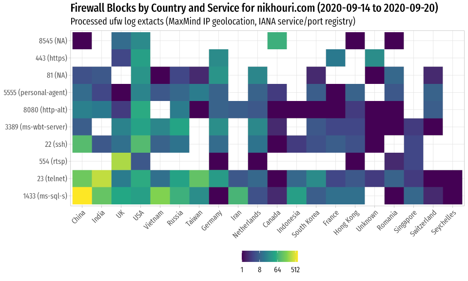

# ggplot2 and data galleries
nik@nikhouri.com

Some reference examples for charting/data access & presentation.

* Github: https://github.com/nikhouri/nikc
* Rendered: https://nikhouri.com/nick/

## Charts

* Rmarkdown [nikc.Rmd](nikc.Rmd)
* Rendered [nikc.html](nikc.html)

## Data

* Rmarkdown [nikc-data.Rmd](nikc-data.Rmd)
* Rendered [nikc-data.html](nikc-data.html)

## Roadmap
  
### Basic Charts
* [x] Lines
* [ ] Step (ex. tick px)
* [x] Bar (categories)
* [x] Stacked bars (time series)
* [x] Range-and-point

### Complex
* [x] Faceted
* [x] Maps
* [x] Heatmap
* [ ] [Multi-panel w/ facets ](https://github.com/vcannataro/COVID19_data_explore/blob/master/output_data/figures/all_states_VS_each_state.png)

### Statistic
* [ ] Scatter
* [ ] Histogram
* [ ] Boxplot alternatives
* [ ] QQ
* [ ] Volcano

### Data
* [x] CSV imports (with dates/times)
* [x] Inline data (CSV from string)
* [ ] `topn` function
* [x] Quandl
* [ ] UK, US, EU Government Data portals
